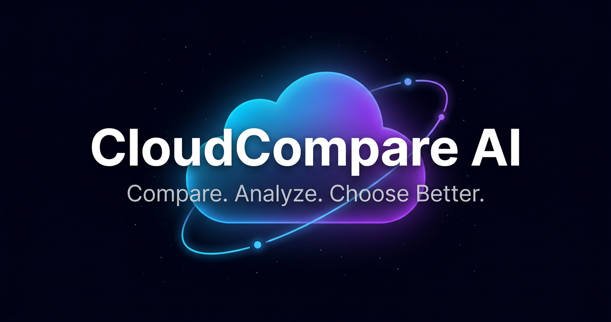
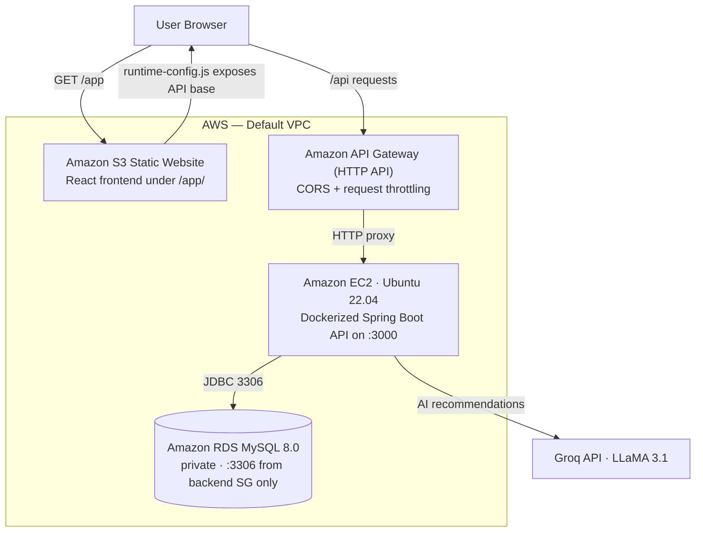

<p align="center">
  
</p>

<h1 align="center">CloudCompare AI</h1>

<p align="center"><strong>Compare. Analyze. Choose Better.</strong><br>
Multi-Cloud Comparison &amp; AI Tool Rankings — one platform to make cloud and AI decisions with confidence.</p>

<p align="center">
  <a href="https://openjdk.org"></a>
  <a href="https://spring.io/projects/spring-boot"></a>
  <a href="https://react.dev"></a>
  <a href="https://aws.amazon.com"></a>
  <a href="https://www.terraform.io"></a>
  <a href="https://www.mysql.com"></a>
  <a href="https://groq.com"></a>
</p>

---

## What is CloudCompare AI?

CloudCompare AI is a multi-cloud decision platform. It analyzes **cost, performance, and regional availability** across the five major clouds — **AWS, Azure, Google Cloud, Oracle Cloud, and Alibaba Cloud** — and evaluates leading **AI tools for your specific use case**, turning raw provider data into clear, ranked recommendations you can act on.

Every account signs in with email and password, and each request is protected by secure token-based (JWT) authentication.

## Features

| Feature | What it does |
|---|---|
| **Multi-Cloud Comparison** | Enter your workload once (vCPU, RAM, storage, hours, region) and compare the five major clouds on estimated cost, performance, and availability — ranked for your exact needs. |
| **AI Tools by Purpose** | Pick one of 8 purposes — coding, content writing, data analysis, image, video, presentations, music & audio, or general research — and get a ranked shortlist of the best AI tools, in plain language. Free-text queries supported. |
| **Dual AI Chatbot** | Two built-in assistants — **Cloud Compare** and **AI Tools** mode — answer follow-ups like *"why is this the best for cost?"* or *"what is cheaper in another region?"* |
| **Instant Visual Reports** | Cost and performance charts, provider cards, and executive summaries generated in seconds, exportable as **PDF** or **CSV**. |
| **Secure Accounts** | JWT-based authentication, BCrypt-hashed credentials, rate limiting, and optional single-use password-reset links delivered by email. |

## Tech Stack

| Layer | Technology |
|---|---|
| Frontend | React 19, Vite, Tailwind CSS 4, Axios, Chart.js (S3-hosted production build) |
| Backend | Java 21, Spring Boot 3.2.5, Spring Web, Spring Security (JWT) |
| Data | Spring Data JPA · Amazon RDS MySQL 8.0 (production) · H2 in-memory (local/test) |
| AI | Groq API — LLaMA 3.1 8B Instant (automatic mock fallback when no key is set) |
| Resilience | Resilience4j, Caffeine caching, request rate limiting, centralized exception handling |
| API Management | Amazon API Gateway (HTTP API) — managed entrypoint, CORS, request throttling |
| Infrastructure | Amazon S3, Amazon EC2, Amazon RDS, Security Groups, default VPC — provisioned with Terraform |
| Containers | Docker (multi-stage Maven build → Temurin 21 JRE) |

## Architecture



### Deployment characteristics

- The React production build (`cloudcompare-frontend/dist`) is uploaded to S3 under `/app/` and served as a static website; Terraform also writes a generated `app/runtime-config.js` that points the app at the API Gateway invoke URL.
- API Gateway accepts all routes (`ANY /{proxy+}`) and proxies them to the Spring Boot container on EC2 port `3000`, with CORS restricted to the frontend origin and per-route throttling (configurable rate/burst).
- EC2 user-data installs Docker on boot, pulls the API image, and starts the container with JWT, Groq, CORS, and RDS connection configuration.
- RDS is **not publicly accessible** — port 3306 is reachable only from the backend security group.
- Sensitive values (DB password, JWT secret, Groq key, allowed CIDRs) are supplied as Terraform variables or environment variables — never stored in code.

### Production outputs

| Terraform output | Value |
|---|---|
| `frontend_url` | `http://<s3-website-endpoint>/app/` |
| `api_gateway_url` | API Gateway invoke URL |
| `backend_url` | `http://<ec2-public-ip>:3000` |
| `rds_endpoint` | RDS MySQL connection endpoint |
| `frontend_bucket_name` | S3 bucket hosting the frontend |
| `backend_public_ip` | EC2 public IP |

## Project Structure

```
CLOUD-COMPARE-AI/
├── src/main/java/com/cloudcompare/ai/
│   ├── controller/        # REST API (compare, AI tools, chat, auth, reset)
│   ├── service/           # Comparison, ranking, chat and email services
│   ├── integration/       # Groq AI + AWS clients
│   ├── security/          # JWT filter, Spring Security config
│   ├── config/ · dto/ · entity/ · repository/ · exception/
├── src/main/resources/
│   ├── static/            # Served web UI (index, dashboard, auth pages)
│   └── application*.properties
├── cloudcompare-frontend/ # React 19 / Vite 8 / Tailwind 4 app (S3 build source)
├── iac/terraform/         # Production AWS deployment (Terraform)
├── Dockerfile             # API container image for EC2
└── .env.example           # Annotated environment template
```

## Getting Started (Local)

**Prerequisites:** JDK 21 and Maven (or use the bundled wrapper `./mvnw`).

```bash
# 1. Clone
git clone https://github.com/yathamsridharreddy/CLOUD-COMPARE-AI.git
cd CLOUD-COMPARE-AI

# 2. Run the backend (H2 in-memory database by default)
./mvnw spring-boot:run
```

The API starts on [http://localhost:8080](http://localhost:8080) and also serves the website UI. Health check: `GET /health`.

> **AI recommendations** run on a built-in mock engine out of the box. To enable live Groq LLaMA 3.1 recommendations, set `GROK_API_KEYS` (see [Groq Console](https://console.groq.com/)):
>
> ```bash
> GROK_API_KEYS=your-groq-key ./mvnw spring-boot:run
> ```

**React app (optional):**

```bash
cd cloudcompare-frontend
npm install
npm run dev        # http://localhost:5173 — proxy /api to :8080
```

## API Overview

Base path: `/api` — all comparison and chat endpoints require a JWT from `/api/auth/login`.

| Method | Endpoint | Description |
|---|---|---|
| `POST` | `/api/auth/signup` | Create an account (name, email, password) |
| `POST` | `/api/auth/login` | Sign in, returns a JWT |
| `POST` | `/api/auth/forgot-password` | Request a single-use password-reset link |
| `POST` | `/api/auth/reset-password` | Set a new password with the reset token |
| `POST` | `/api/compare` | Structured multi-cloud comparison (vCPU/RAM/storage/hours/region/priority) |
| `POST` | `/api/ai-compare` | Ranked AI tool recommendations for a chosen purpose |
| `POST` | `/api/nlp-compare` | Plain-language comparison via the AI |
| `POST` | `/api/chat/cloud` | Cloud Compare chatbot |
| `POST` | `/api/chat/ai-tools` | AI Tools chatbot |
| `GET` | `/api/regions` | Supported regions |
| `GET` | `/api/service-types/{category}` | Service types for a category (compute, storage, …) |
| `GET` | `/health` | Liveness probe (unauthenticated) |

## Environment Variables

| Variable | Required | Purpose |
|---|---|---|
| `JWT_SECRET` | Production | JWT signing secret (min. 64 characters) |
| `GROK_API_KEYS` | Optional | Enables live Groq LLaMA 3.1 AI (mock fallback otherwise) |
| `SPRING_DATASOURCE_URL` / `DB_*` | Production | MySQL JDBC connection to RDS (injected by Terraform on EC2); H2 in-memory is the local default |
| `CORS_ALLOWED_ORIGINS` | Production | Frontend origin allowed to call the API (set to the S3 site URL by Terraform) |
| `PASSWORD_RESET_ENABLED` + `GMAIL_*` | Optional | Email delivery of reset links via the Gmail API — see [docs/PASSWORD_RESET_GMAIL.md](docs/PASSWORD_RESET_GMAIL.md) |

See [.env.example](.env.example) for the annotated template.

## Production Deployment (AWS)

The production environment is provisioned entirely with **Terraform** from `iac/terraform` into the default AWS VPC (default region `us-east-1`):

| Layer | AWS Service | Purpose |
|---|---|---|
| Frontend | Amazon S3 Static Website Hosting | Serves the React production build under `/app/` |
| API Management | Amazon API Gateway (HTTP API) | Managed entrypoint, CORS, request throttling |
| Backend | Amazon EC2 (t2.micro, Ubuntu 22.04) | Runs the Spring Boot API as a Docker container on port 3000 |
| Database | Amazon RDS for MySQL 8.0 (db.t3.micro) | Private, 20 GB — stores user credentials and application data |
| Networking | Default VPC + 2 Security Groups | Public API access; DB reachable from the backend SG only |

```bash
# 1. Build the frontend (uploaded by Terraform)
cd cloudcompare-frontend
npm ci && npm run build
cd ../..

# 2. Provision the stack
cd iac/terraform
terraform init
terraform plan    # supply credentials/keys via -var or TF_ environment variables
terraform apply
```

Key Terraform variables: `backend_docker_image`, `backend_instance_type` (default `t2.micro`), `rds_instance_class` (default `db.t3.micro`), `db_username` / `db_password` / `db_name` (default `cloudcompare`), `jwt_secret`, `groq_api_key`, `ec2_key_name`, `allowed_ssh_cidr_blocks`, `allowed_backend_cidr_blocks`, `api_gateway_throttle_rate_limit` / `api_gateway_throttle_burst_limit`.

## Documentation

- [ARCHITECTURE.md](ARCHITECTURE.md) — full system design and data flow
- [docs/PASSWORD_RESET_GMAIL.md](docs/PASSWORD_RESET_GMAIL.md) — optional Gmail API email integration

## Contact

For questions or feedback, reach out at [yathamsridharreddy99@gmail.com](mailto:yathamsridharreddy99@gmail.com).
